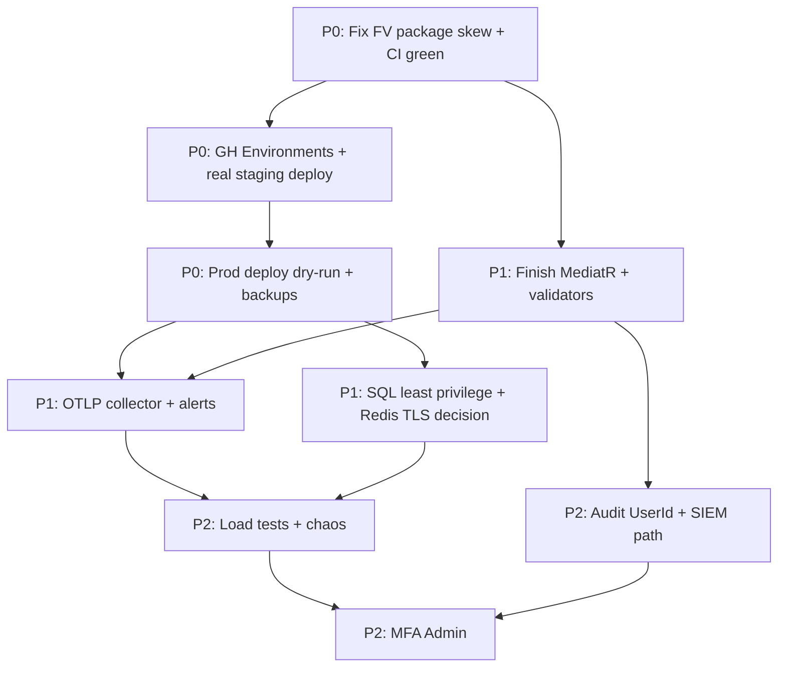

# Production Readiness Checklist & Improvement Roadmap

**System:** Healthcare Appointment Notification System  
**Horizon:** next 2–3 months  
**Last reviewed:** 2026-07-13 (JWT refresh after profile create)  

Use this document as the **single progress tracker**. Check boxes as work ships; update **Status** columns on the roadmap.

**Legend — Status**

| Symbol | Meaning |
|--------|---------|
| ✅ | Done in codebase / process |
| 🟡 | Partially done / needs ops or finish |
| ⬜ | Not started |

---

# 1. Production Readiness Checklist

## Critical (ship-blockers / severe risk)

| # | Item | Status | Notes / evidence |
|---|------|--------|------------------|
| C1 | No secrets in git / images | ✅ | Empty appsettings secrets; `.env.secrets` + GH Environments (`docs/secrets-management.md`) |
| C2 | JWT secret fail-fast + HS256-only validation | ✅ | `JwtSettings`, `JwtTokenValidation`; edge tests |
| C3 | Password hashing (Argon2id) | ✅ | `Argon2IdPasswordHasher` + BCrypt upgrade path (ADR 0004) |
| C4 | Access control on appointments/patients (ownership + roles) | ✅ | Controllers + integration/authz tests; **Doctor PHI scoped** via care relationship (`PatientRecordAccess` + `HasDoctorPatientCareRelationshipAsync`) on `GET Appointments/patient/{id}` and `GET Patients/{id}` |
| C4b | Self-service profile identity link (`User.PatientId` / `DoctorId`) | ✅ | **Fixed:** `SaveChanges` before `LinkToPatient`/`LinkToDoctor`; SQLite regression tests (`CreateProfileLinkIdentityRegressionTests`). **JWT claims without re-login:** FE `refreshSession()` after CreatePatient/CreateDoctor profile (`AuthContext` + `CreatePatientProfilePage` / doctor dashboard); removed client-only `setPatientId`/`setDoctorId`; integration: canary uses `/Auth/refresh`, `CreatePatientProfile_ThenBookAppointment_SameSessionWithoutRelogin_Succeeds` |
| C5 | Double-booking prevention (lock + domain + unique index) | ✅ | Handler lock, `IsAvailable`, concurrency unit + integration tests |
| C6 | Stripe webhook signature verification (fail closed) | ✅ | Signature path + **Production fails fast** if `Stripe:WebhookSecret` missing (`ProductionStartupGuards` + `Program.cs`); non-Production warns; tests: `StripeWebhookSecretStartupTests` |
| C6b | PaymentIntent ↔ appointment binding (anti-rebinding) | ✅ | `PaymentIntentBinding` checks `metadata.appointment_id` (+ amount/currency) in `ProcessPaymentHandler` before reconcile; gateway returns PI metadata; tests: rebinding rejection in `PaymentCompensationFlowTests` / `ProcessPaymentHandlerTests` |
| C7 | HTTPS / HSTS / security headers / CORS lockdown | ✅ | `SecurityHeadersMiddleware` (CSP, XFO DENY, nosniff, Referrer-Policy, Permissions-Policy, CORP/COOP) + `UseHsts` (365d, includeSubDomains, preload) early in pipeline; CORS locked down; tests: `SecurityHeadersMiddlewareTests` |
| C8 | Rate limiting (proxy-aware) | ✅ | Implemented; **Production fails fast** without `TrustedProxies` / `TrustedNetworks` (`ProductionStartupGuards` + `Program.cs`); non-Production warns; tests: `TrustedProxyGuardTests`, `TrustedProxyStartupTests` |
| C9 | Database migrations on deploy/start | ✅ | `DatabaseSeeder` applies migrations |
| C10 | No demo data / default admin in Production | ✅ | Gated seeding + bootstrap secrets |
| C11 | Outbox durable events (or explicit in-proc only for non-prod) | ✅ | Outbox + relay + DLQ (ADR 0003) |
| C12 | Health endpoints for orchestrator/LB | ✅ | `/health/live`, `/health/ready`, `/health`, `/health/details` |
| C13 | CI gate before images (tests + package vulns) | ✅ | `.github/workflows/ci.yml` |
| C14 | Image scan (Trivy HIGH/CRITICAL) before promote | ✅ | `build-and-publish.yml` |
| C15 | Staging ≠ Production secrets & deploys | 🟡 | Workflows exist; **must configure GH Environments + hosts** |
| C16 | Backup/restore for SQL (RPO/RTO defined) | ⬜ | Ops/runbook — not automated in repo |
| C17 | PHI logging hygiene (no clinical free text in logs) | 🟡 | Structured logs; audit policy still manual |
| C18 | Full suite green on CI agents (incl. integration) | 🟡 | Architecture + unit solid; **FluentValidation.AspNetCore vs FV12** may break host tests |

---

## High (should fix before serious traffic / audits)

| # | Item | Status | Notes |
|---|------|--------|-------|
| H1 | Complete MediatR migration (all commands/queries) | 🟡 | Pilots done; many `ICommandHandler` remain (ADR 0002) |
| H2 | Application FluentValidation for every command | 🟡 | Pilots only; API validators exist |
| H3 | Populate audit `UserId` from ambient current user | ✅ | `IAuditContext`/`HttpAuditContext` + `IAuditLogService`; actor/role/IP/correlation on rows; MediatR `AuditLoggingBehavior` |
| H4 | Observability wired to real collector (OTLP) | 🟡 | Code ready; **need collector + dashboards + alerts** |
| H5 | Alerts: DLQ, health ready, payment fail rate, auth fail spike | ⬜ | Metrics exist; alert rules not in repo |
| H6 | Outbox DLQ runbook + optional requeue admin API | 🟡 | Logging/metrics; no admin requeue UI |
| H7 | SQL Server not using `sa` for app (least privilege login) | ⬜ | Compose still SA for simplicity |
| H8 | Encryption at rest (disk/TDE) + backup encryption | ⬜ | Infrastructure |
| H9 | Dependabot/Renovate + SLAs on Critical CVEs | 🟡 | CI NuGet vulnerable scan; enable Dependabot |
| H10 | MFA for Admin (and ideally Doctor) | ⬜ | Local passwords only |
| H11 | Integration/auth tests stable under WebApplicationFactory | 🟡 | FV version skew / host issues observed |
| H12 | Production deploy: known_hosts pinned, reviewers required | 🟡 | Workflow enforces known_hosts; **enable GH env protection** |
| H13 | Redis auth / TLS if Redis leaves private network | ⬜ | Private compose network today |
| H14 | Load/smoke test booking + payment under concurrency | ⬜ | Unit/integration only |
| H15 | Documented incident response + on-call for outbox/payments | ⬜ | Partial docs |

---

## Medium (quality, maintainability, ops polish)

| # | Item | Status | Notes |
|---|------|--------|-------|
| M0 | Frontend validation UX (field errors + password strength) | ✅ | `useApiError` + Axios normalize; Register/Login/Book with RHF; strength meter; toast only for non-field errors |
| M0b | Frontend mobile responsiveness + accessibility (patient journey) | ✅ | Shared UI: 44px touch targets, form `aria-describedby`, Modal focus trap/restore; pages: Login/Register/Book/Pay/MyAppts/Dashboard/Doctors; no page-level H-scroll (`Layout` + `overflow-x`); skip link |
| M1 | Finish ADRs as living process (new decisions get ADRs) | ✅ | `docs/adr/*` foundation |
| M2 | Dedicated SQL login + connection string without SA | ⬜ | Related H7 |
| M3 | Field-level encryption for clinical notes / DOB | ⬜ | Product/compliance decision |
| M4 | SIEM export / immutable audit store | 🟡 | **Immutable store done:** enriched `AuditLogEntry` + append-only interceptor + admin query API; SIEM export still open (R3.6) |
| M5 | Tighten `AllowedHosts` per environment | ⬜ | |
| M6 | OpenAPI / client SDK generation for frontend | ⬜ | |
| M7 | Frontend E2E (Playwright) critical paths | ⬜ | Vitest unit exists |
| M8 | Chaos: kill Redis/SQL during booking & refresh | ⬜ | |
| M9 | Performance budgets (p95 book/pay) in CI | ⬜ | PerformanceBehavior warns only |
| M10 | Multi-region / HA Redis (if SLA requires) | ⬜ | |
| M11 | Replace remaining console notification with real email in prod compose | 🟡 | Adapters exist; wire per env |
| M12 | Architecture test expansion (Presentation→Adapters exceptions only) | 🟡 | Core rules exist |
| M13 | Payment webhook idempotency dashboard | ⬜ | Code idempotent; ops view missing |
| M14 | Capacity plan (Argon2 memory × concurrent logins) | ⬜ | |

---

## Low (nice-to-have / later)

| # | Item | Status | Notes |
|---|------|--------|-------|
| L1 | OIDC / external IdP (replace local passwords) | ⬜ | ADR 0005 non-goal for now |
| L2 | CDC outbox (Debezium) instead of poll relay | ⬜ | ADR 0003 alternative |
| L3 | Kubernetes manifests / Helm | ⬜ | Compose is current target |
| L4 | GraphQL BFF | ⬜ | |
| L5 | Mobile clients | ⬜ | |
| L6 | Full i18n beyond en/sq scaffolding | 🟡 | Localization started |
| L7 | Blue/green beyond compose rollback script | 🟡 | Script rollback exists |
| L8 | Feature flags platform | ⬜ | |

---

# 2. Improvement Roadmap (2–3 months)

Phases assume **~part-time / solo–small team**. Adjust weeks if you have more capacity.

```
Month 1 ──► Stabilize “production truth” (security ops + CI + deploy)
Month 2 ──► Application completeness + observability in anger
Month 3 ──► Hardening, compliance depth, performance confidence
```

### Dependency overview



---

## Phase 0 — Week 1–2: “Make the pipeline trustworthy”

| ID | Task | Priority | Effort | Impact | Depends on | Done |
|----|------|----------|--------|--------|------------|------|
| R0.1 | Align FluentValidation versions (FV 11.x **or** drop FV.AspNetCore auto-validation in favor of MediatR validators only) so WebApplicationFactory / integration tests stop TypeLoadException | Critical | Medium | Unblocks CI confidence & authz host tests | — | ⬜ |
| R0.2 | Enable Dependabot (NuGet + npm + Actions); triage Critical weekly | High | Low | Supply-chain hygiene | — | ⬜ |
| R0.3 | Add GH Environments `staging` / `production` with **separate** secrets; production **required reviewers** | Critical | Low | Prevents accidental prod deploys & secret bleed | — | ⬜ |
| R0.4 | Pin `DEPLOY_SSH_KNOWN_HOSTS`; smoke **staging** deploy of last green image | Critical | Medium | Proves CD path | R0.3 | ⬜ |
| R0.5 | Define backup: nightly SQL full + weekly restore drill; document RPO/RTO | Critical | Medium | Data loss readiness | — | ⬜ |
| R0.6 | Startup fail-closed: Production requires `Stripe:WebhookSecret` + **TrustedProxies/TrustedNetworks** | High | Low | Closes residual OWASP gaps | — | ✅ Done: `ProductionStartupGuards.cs`; host + pure unit tests |

**Exit criteria:** CI fully green; staging deploy from GH succeeds; restore drill documented once.

---

## Phase 1 — Week 3–5: “Operate like production”

| ID | Task | Priority | Effort | Impact | Depends on | Done |
|----|------|----------|--------|--------|------------|------|
| R1.1 | Deploy OTLP collector (Grafana Alloy / Tempo+Prometheus+Loki or cloud APM); set `Otel:Endpoint` | High | Medium | Traces/metrics/logs usable | R0.4 | ⬜ |
| R1.2 | Dashboards: request rate/errors, booking, payments, outbox DLQ/circuit, health ready | High | Medium | Situational awareness | R1.1 | ⬜ |
| R1.3 | Alerts: `/health/ready` fail, outbox dead-letter rate, payment fail ratio, login fail spike, cert/disk | High | Medium | MTTD | R1.2 | ⬜ |
| R1.4 | Outbox DLQ runbook + SQL requeue procedure (optional minimal Admin API) | High | Medium | Recover poison events | R1.1 | ⬜ |
| R1.5 | First **production** deploy (tag `v*`) with bootstrap admin once, then disable bootstrap | Critical | Medium | Live system | R0.4, R0.5, R0.6 | ⬜ |
| R1.6 | Wire real email adapter in production compose (not console) | Medium | Low–Med | Real notifications | R1.5 | ⬜ |
| R1.7 | SQL app login (not `sa`); secrets updated | High | Medium | Blast-radius reduction | R1.5 | ⬜ |

**Exit criteria:** Prod receiving traffic (even limited); alerts firing to a real channel (email/Slack); backups proven.

---

## Phase 2 — Week 6–8: “Application completeness”

| ID | Task | Priority | Effort | Impact | Depends on | Done |
|----|------|----------|--------|--------|------------|------|
| R2.1 | MediatR: Cancel / Complete / MarkNoShow + remove legacy controller injections | High | Medium | Uniform pipeline (logs/metrics/validation/tx) | R0.1 | ⬜ |
| R2.2 | MediatR: payments + patients/doctors commands | High | High | Same | R2.1 | ⬜ |
| R2.3 | Application validators for all migrated commands | High | Medium | Defense in depth | R2.1–R2.2 | ⬜ |
| R2.4 | `ICurrentUser` / ambient user → audit log `UserId` on domain handlers | High | Medium | Accountability / HIPAA-aligned audit | R2.1 | ✅ `HttpAuditContext` + `AuditLogService`; auto-audit BookAppointment/GetAppointment; manual GetPatient/ProcessPayment/CreatePatient |
| R2.5 | Expand architecture tests if Presentation still leaks Adapters | Medium | Low | Layering integrity | R2.1 | ⬜ |
| R2.6 | Frontend E2E: login, book, pay (test mode), cancel | Medium | Medium | Catches contract breaks | R1.5 | ⬜ |

**Exit criteria:** Controllers mostly `IMediator`-only for writes; audit trails include actor id.

---

## Phase 3 — Week 9–12: “Harden & prove”

| ID | Task | Priority | Effort | Impact | Depends on | Done |
|----|------|----------|--------|--------|------------|------|
| R3.1 | k6/JMeter: concurrent booking same slot; payment reconcile storms | High | Medium | Capacity + double-book confidence | R1.5, R2.1 | ⬜ |
| R3.2 | Chaos day: Redis down, SQL brief outage, outbox backlog drain | Medium | Medium | Failure mode playbooks | R1.3–R1.4 | ⬜ |
| R3.3 | MFA for Admin (TOTP or IdP) | High | High | Credential stuffing resistance | R1.5 | ⬜ |
| R3.4 | Redis AUTH (+ TLS if exposed beyond Docker network) | Medium | Medium | Defense in depth | R1.7 | ⬜ |
| R3.5 | Encryption at rest verification (Azure/AWS disk or SQL TDE) | High | Medium–High | Compliance baseline | R0.5 | ⬜ |
| R3.6 | SIEM export of security + audit logs (or file shipper) | Medium | Medium | Detection / forensics | R1.1, R2.4 | ⬜ |
| R3.7 | Optional: Doppler/Key Vault for secrets (upgrade path from ADR secrets doc) | Medium | Medium | Rotation & audit of secrets | R0.3 | ⬜ |
| R3.8 | Review ADR backlog; add ADRs for MFA / IdP if chosen | Low | Low | Decision hygiene | R3.3 | ⬜ |

**Exit criteria:** Load/chaos notes filed; MFA on admin; encryption & logging export decided and at least partially live.

---

# 3. Suggested calendar (track progress)

### Month 1

| Week | Focus | Checklist targets |
|------|--------|-------------------|
| 1 | R0.1–R0.3, Dependabot | C13, C18, H9, H12 start |
| 2 | R0.4–R0.6 staging + backups | C15, C16, C6, C8 |
| 3 | R1.1–R1.3 observability | H4, H5 |
| 4 | R1.4–R1.7 first prod + SQL login | C10–C15, H7 |

### Month 2

| Week | Focus | Checklist targets |
|------|--------|-------------------|
| 5–6 | R2.1–R2.3 MediatR + validators | H1, H2 |
| 7 | R2.4 audit UserId + R1.6 email | H3, M11 |
| 8 | R2.6 E2E + buffer/debt | H11, M7 |

### Month 3

| Week | Focus | Checklist targets |
|------|--------|-------------------|
| 9–10 | R3.1–R3.2 load + chaos | H14, M8 |
| 11 | R3.3–R3.4 MFA + Redis | H10, H13 |
| 12 | R3.5–R3.7 compliance polish + ADR update | H8, M3–M4, L1 decision |

---

# 4. Effort & impact summary (roadmap only)

| Priority band | Effort Low | Effort Medium | Effort High |
|---------------|------------|---------------|-------------|
| **Critical** | R0.3 | R0.1, R0.4, R0.5, R1.5 | — |
| **High** | R0.2, R0.6 | R1.1–R1.4, R1.7, R2.1, R2.3–R2.4, R3.1, R3.5 | R2.2, R3.3 |
| **Medium** | R1.6, R2.5 | R2.6, R3.2, R3.4, R3.6–R3.7 | — |
| **Low** | R3.8 | — | — |

**Highest ROI sequence if time-constrained:**  
`R0.1 → R0.3 → R0.4 → R0.5 → R1.5 → R1.1/R1.3 → R2.1 → R3.1`

---

# 5. Already strong (don’t re-do; maintain)

Treat these as **maintenance**, not roadmap invent-from-scratch:

| Area | Reference |
|------|-----------|
| CreatePatient/CreateDoctor identity flush before link | `CreatePatientHandler` / `CreateDoctorHandler`; `Helpers/EfCoreSqliteFixture`; `CreateProfileLinkIdentityRegressionTests` |
| Outbox resilience, metrics, DLQ | ADR 0003, outbox tests |
| Observability code (OTel + business metrics + correlation) | `docs/monitoring.md` |
| Secrets model (GH env + host files) | `docs/secrets-management.md` |
| CI/CD + Trivy + SBOM + staging/prod workflows | `.github/workflows/*` |
| Auth design (JWT + refresh family + sessions) | ADR 0005 |
| Password hashing | ADR 0004 |
| Concurrency tests (unit + integration) | Book + DoubleBooking tests |
| Architecture governance | `docs/architecture-governance.md` |
| ADRs index | `docs/adr/README.md` |

---

# 6. How to use this doc weekly

1. **Monday:** Pick 1 Critical or 2 High incomplete roadmap rows.  
2. **During week:** Tick checklist + roadmap `Done` when merged and verified in staging.  
3. **Friday:** Note blockers under the row (one line).  
4. **End of month:** Re-score priorities if compliance/MFA dates moved.

---

# 7. Definition of “Production ready” (exit for the 3-month horizon)

You can call the system **production-ready for limited clinical/admin traffic** when:

1. ✅ Critical checklist items C1–C15 are ✅ or 🟡 only with **written residual risk**.  
2. Staging and production deploys are routine via GitHub Actions.  
3. Backups restored successfully at least once.  
4. OTLP metrics/logs/traces reachable; alerts hit a human channel.  
5. MediatR covers appointment write path (book/confirm/cancel/complete/no-show) with validators.  
6. Concurrent booking load test shows only one success per slot.  
7. Admin MFA planned or live (if passwords remain local).

Until then, treat production as **pilot** with restricted users and heightened monitoring.
